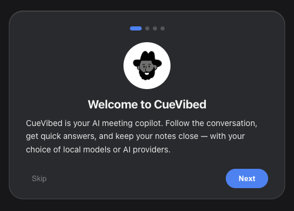
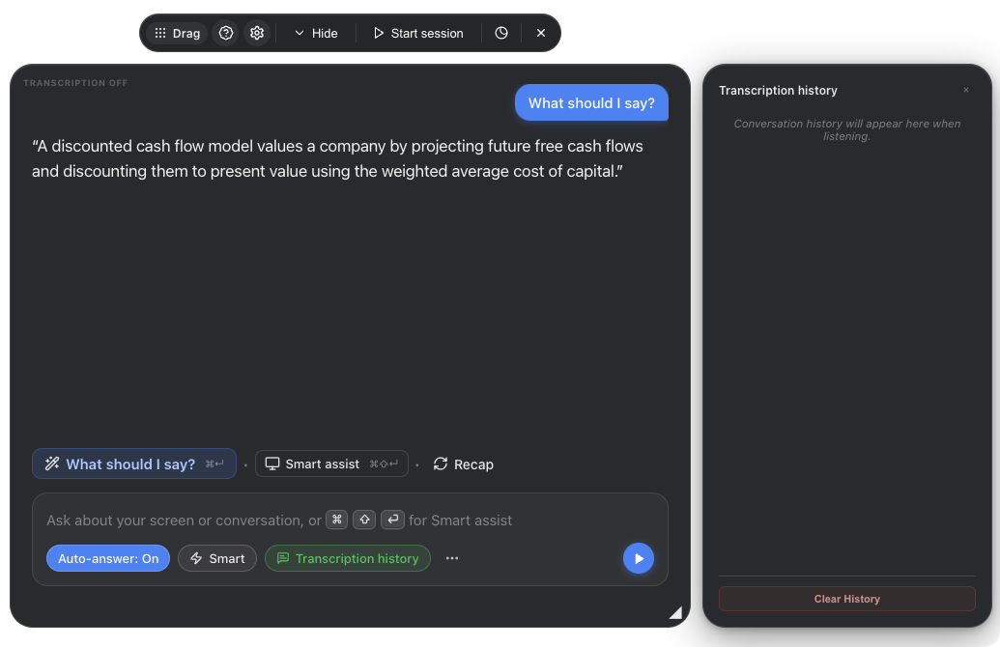
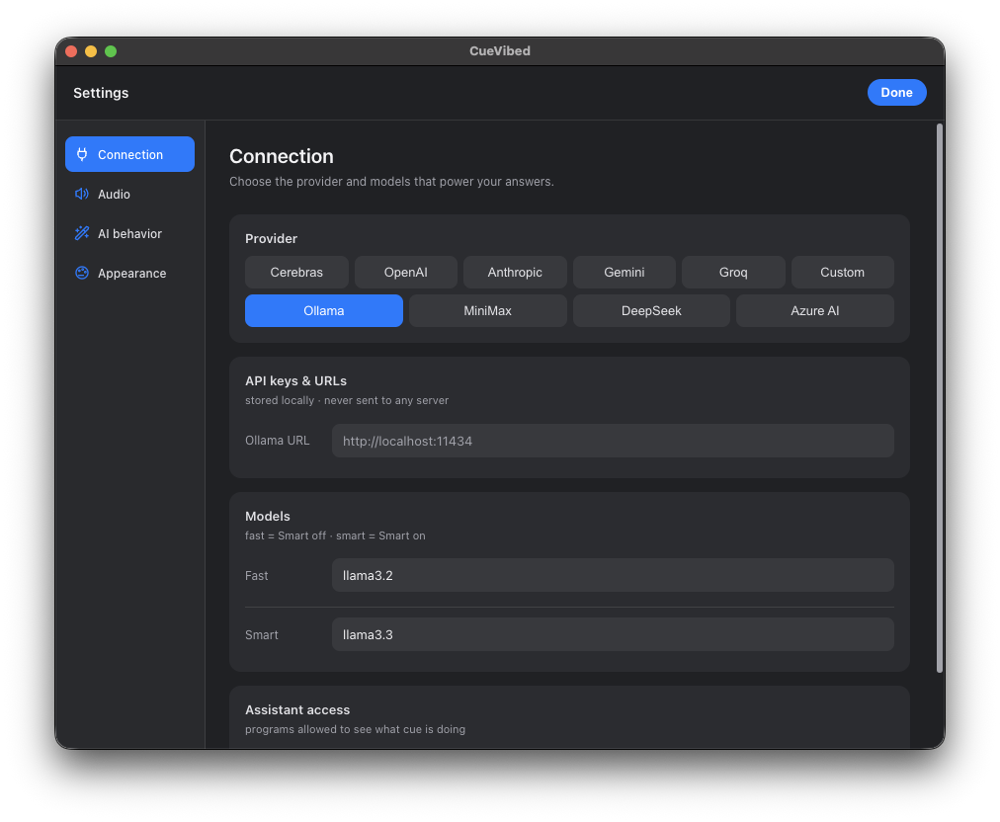

<div align="center">

# CueVibed

**An open-source Cluely alternative for macOS with live transcription and automatic answers.**

Run a local model or connect your own AI provider. Resize the overlay and adjust its text size and background opacity to suit your meeting.



</div>

> [!IMPORTANT]
> **Please read this first.** CueVibed tries to stay out of screen recordings/shares, but this is **best-effort, not guaranteed** — on macOS 15.4+ Apple can let modern capture tools see it anyway, and a phone camera always can. Using a hidden assistant during a **proctored exam, job interview, or recorded meeting** may break that platform's rules and, in some places, consent laws. CueVibed is built for legitimate uses — your own notes, studying, accessibility, and practice. **You are responsible for how you use it.**

## Why CueVibed?

CueVibed transcribes your microphone and meeting audio into separate channels. Enable Auto-answer to get a short suggested response when the other side asks a question.

CueVibed is a fork of [Cue](https://github.com/Blueturboguy07/cue) for **macOS with Apple Silicon**. It keeps Cue’s transcription, model integrations, screen-aware assistance, and meeting memory, and adds auto-answer, a resizable overlay, and separate Settings.

You can run both transcription and answers on your Mac, or choose a hosted provider for either. Hosted providers may charge for usage. For local answers, you need a running model server; local transcription needs a downloaded speech model.

## Looking for a Cluely or Pluely alternative?

CueVibed is a free, open-source AI meeting assistant for Apple Silicon Macs. If you're looking for a Cluely replacement, a Pluely alternative, or a macOS-focused fork of Cue, it provides live transcription, suggested responses during calls, screen-aware assistance, and conversation recaps in a resizable desktop overlay.

**No app feature paywalls.** You do not need a subscription or a Pro upgrade to resize the window, make the text bigger, read the full reply, or open transcript history. Auto-answer, appearance controls, and local model connections are included too. Being able to read your meeting assistant should not be a paid feature.

Use local Whisper for speech-to-text and a local model server such as oMLX or Ollama for answers, or connect your own supported cloud provider. The app does not require a CueVibed subscription; hosted AI providers may charge for usage. Running locally requires enough memory for your chosen models.

CueVibed is an independent fork of Cue, not affiliated with Cluely or Pluely. It is an alternative for these meeting-assistant workflows, not a feature-for-feature replacement. See the setup instructions and limitations below before switching.

## A look inside

**Meeting view** — answers, quick actions, and transcript history alongside the conversation.

<p align="center">
  
</p>

**Settings** — a separate window for your models, audio, AI behavior, and appearance.

<p align="center">
  
</p>

## What this fork adds

This table compares CueVibed with the Cue version it forked from. Upstream Cue may have changed since then.

| Addition | What it means during a meeting |
|---|---|
| **Automatic answers** | Responds to detected questions and requests without a Send click. Waits briefly for the speaker to continue and suppresses duplicate triggers. |
| **Resizable overlay** | Drag the bottom-right handle to make room for answers. CueVibed saves the window dimensions. |
| **Conversation scrolling** | Replies stay in view as they stream. Scroll up to read earlier answers; return to the bottom to resume following. |
| **Transcript history open by default** | Read the conversation without opening the sidebar first. Use the history button to hide it. |
| **Separate Settings window** | Drag Settings aside or onto another display. It stays above the meeting overlay while open. |
| **Redesigned Settings** | Find controls through sidebar navigation. Grouped rows adapt to the window width and use matching line icons. |
| **Readable transparency** | Background opacity changes without fading the answer text and controls. |
| **Independent text sizes** | Choose Small, Medium, or Large separately for answers and transcripts. |
| **Settings themes** | System, Light, and Dark, with an opaque Settings surface independent of overlay transparency. |
| **Noise handling adjustments** | Disables automatic microphone gain and waits for sustained sound before accepting speech to reduce isolated click triggers. |
| **Refreshed onboarding** | A CueVibed welcome screen, updated setup instructions, and line icons in place of emoji. |

The noise filter uses sound levels and duration, so it can accept sustained noise or miss very short speech.

## What you can do

| Feature | How to trigger | What it uses |
|---|---|---|
| **Smart assist** | `⌘` `⇧` `↵` | Your screen + recent conversation |
| **What should I say?** | `⌘` `↵` | Meeting audio + your mic |
| **Recap** | Button | The conversation |
| **Ask anything** | Type + `↵` | Your screen + conversation |
| **Solve a coding problem** | `⌘` `H` | Your screen only |
| **Smart** toggle | Pill in the typing box | Switches between your configured Fast and Smart models |
| **Auto-answer** | Enable the toggle beside the typing box | Detected questions from meeting audio (**Them**) + recent conversation |

- **Follow a live transcript:** your microphone appears as **You**; system audio appears as **Them**.
- **Get automatic or manual answers:** enable Auto-answer, type a question, or ask what to say next.
- **Ask about your screen:** use Smart assist with a model that supports image input.
- **Recap the conversation:** generate a summary using your selected model.
- **Keep meeting context:** inherited meeting memory saves transcripts locally and can generate notes with your chosen chat provider.
- **Choose your stack:** local Whisper transcription, local OpenAI-compatible chat servers, or supported hosted providers.

**Auto-answer is off by default.** It responds only to the **Them** channel and uses lightweight English question/request patterns. It will not answer every sentence or reliably understand every phrasing.

**There is no built-in web research or document RAG pipeline.** Answers come from your selected model and the context supplied by the app. They are not automatically checked against current documentation or guaranteed to be correct.

## Run on macOS

CueVibed supports **macOS on Apple Silicon**. **Windows is not supported, and there are no plans for a Windows port.** Linux and Intel Macs are also unsupported.

### Download a packaged app

Check this fork's [Releases](../../releases) for an Apple Silicon macOS build. If one is available, download the `mac-arm64.zip`, unzip it, and move `CueVibed.app` into Applications. If there is no suitable release, use the source instructions below. Upstream Cue releases do not include CueVibed's changes.

### From source

Requirements:

- Node.js **22.12 or newer** and npm.
- For local transcription: **CMake** and **Xcode command-line tools** to prepare the Whisper runtime.
- Microphone and screen/audio-recording permissions for the capture features you use.

```bash
git clone https://github.com/0fif/cuevibed.git
cd cuevibed
npm install
npm run prepare:whisper
npm start
```

Skip `prepare:whisper` if you only use hosted transcription. It prepares the runtime; you still download a speech model from Settings.

Quit other running copies of Cue or CueVibed before starting. Running from source does not update an app already in Applications.

### Permissions and macOS support

The app lists **macOS 14.4+** as the requirement for meeting-audio capture. Screen assistance and microphone transcription are separate features.

| Capability | macOS setup |
|---|---|
| Your microphone (**You**) | Allow Microphone access |
| Meeting/system audio (**Them**) | Enable Meeting audio and grant screen/audio-recording access |
| Screen-aware assistance | Grant Screen Recording access; choose a vision-capable chat model |
| Screen-share exclusion | Best effort; test your actual sharing setup |

Open **System Settings → Privacy & Security → Microphone** and **Screen Recording** (the wording can include system audio on newer macOS versions). Enable the running app, which appears as **CueVibed** in packaged builds or may appear as **Electron** during development, and quit/reopen if requested. Permissions granted to an installed build may not apply to a development build.

### Build an app

```bash
CUE_BUNDLE_WHISPER=1 npm run dist:mac:arm64
```

For an unpacked development app, use `CUE_BUNDLE_WHISPER=1 npm run pack`. To check the prepared runtime, use `npm run verify:whisper-runtime`.

Build output goes into `dist/`. `CUE_BUNDLE_WHISPER=1` prepares and bundles the local Whisper runtime; macOS builds skip it without that flag. Signing and notarization depend on your build configuration; rebuilding may require granting macOS permissions again.

CueVibed uses its own app identifier (`com.cuevibed.app`) and data folder (`~/Library/Application Support/CueVibed`). On first launch it copies existing Cue settings, meeting history, and downloaded Whisper models into that folder. It keeps the originals and does not overwrite existing CueVibed data. Later changes stay separate. Quit Cue before launching CueVibed so the imported data is up to date.

## Set up your first meeting

### 1. Connect a chat model

Open **Settings → Connection**. Choose a provider and configure its credentials and model IDs.

For a local OpenAI-compatible server such as oMLX, select **Custom**:

| Setting | Example |
|---|---|
| Base URL | `http://127.0.0.1:8000/v1` |
| API key | Your local server's key, if authentication is enabled |
| Fast model | The exact model ID served by your server |
| Smart model | The same model, or another model for the Smart toggle |

Ollama also has its own provider option. Match the URL and model names to your running server. A text-only model can answer conversation questions; screen-aware requests need image support.

### Hosted providers and API keys

Use the toolbar Settings button or the `…` button beside the typing box, then open **Connection**. CueVibed stores provider keys in `cue-data.json` on your Mac and uses them for requests to that provider. Chat and speech-to-text access are separate: a working chat key does not necessarily permit transcription.

| Provider | Key/account | Configuration in CueVibed |
|---|---|---|
| **Cerebras** | [Cerebras console](https://cloud.cerebras.ai) | Chat provider; use Local or another configured service for transcription. |
| **OpenAI** | [OpenAI API keys](https://platform.openai.com/api-keys) | Chat and speech integrations. A key restricted to chat alone may fail for transcription. |
| **Anthropic** | [Anthropic console](https://console.anthropic.com) | Chat and screen-aware assistance with compatible models; configure transcription separately. |
| **Google Gemini** | [Google AI Studio](https://aistudio.google.com/apikey) | Chat and transcription integrations; model access and quotas depend on your account. |
| **Azure AI Foundry** | [Azure AI](https://ai.azure.com) | Set the endpoint and credentials. Model fields use your deployment names; transcription is separate. |
| **DeepSeek** | [DeepSeek platform](https://platform.deepseek.com/api_keys) | OpenAI-compatible chat integration; configure transcription separately. |
| **Groq** | [Groq console](https://console.groq.com) | Chat integration and a Groq Whisper batch-transcription path in Auto mode. |
| **MiniMax** | Your MiniMax account | Set the key and matching Global/China region in Connection. |
| **Ollama** | Your local server | Set the server URL and installed model IDs. |
| **Custom** | Your endpoint or gateway | Set the Base URL and Fast/Smart model IDs; chat authentication is optional if the server permits it. |

For Azure, CueVibed normalizes the endpoint to an OpenAI-compatible `/openai/v1` path. Use the endpoint and deployment names from your service rather than a generic model nickname.

Custom endpoint examples:

| Server | Base URL example | Model field |
|---|---|---|
| oMLX | `http://127.0.0.1:8000/v1` | Exact model ID loaded in oMLX |
| Ollama through Custom | `http://127.0.0.1:11434/v1` | Installed Ollama model ID |
| OpenClaw-compatible gateway | `http://127.0.0.1:18789/v1` | The gateway's configured model ID |

**Custom transcription is opt-in.** Selecting Custom for chat does not send audio there automatically. Select **Custom in Audio** only if the endpoint supports audio transcription. Custom transcription requires a key, Base URL, and supported transcription model.

### Optional publik API integration inherited from Cue

Builds configured with a publik app token show the publik integration. Other builds hide it. You can use local models or your own provider keys without publik.

Before activating publik, read its onboarding disclosure for pricing, account setup, and where it sends your data. Connection includes linking, balance, pricing, and disconnect controls. Use **Use my own key instead** to choose another provider. Check the disclosure and service's current pricing for request costs, plans, and any available credits.

For maintainers, source builds can use `PUBLIK_APP_TOKEN`; the inherited release workflow can embed a repository secret of the same name. Only token-configured builds include the service option.

### 2. Configure transcription

Open **Settings → Audio**:

1. Choose **Local** for on-device Whisper transcription.
2. Select a model, download it, and wait for the runtime and model to be ready.
3. Enable **Meeting audio** to capture the other side of the call.

You can also choose hosted transcription in Audio. That choice is separate from your chat provider in Connection.

Local mode does not silently fall back to cloud transcription. Model downloads need a network connection; local transcription itself runs on your Mac.

### Local model management and streaming transcription

`base.en` is the default recommended English model. Settings includes multilingual and quantized alternatives. Larger models can use more memory and take longer to transcribe. Their download sizes do not tell you how much memory they need to run.

- The local model loads once per listening session and serves both **You** and **Them**.
- You can cancel and resume downloads. CueVibed checks their sizes and SHA-256 hashes against the model manifest.
- Import or delete models in **Settings → Audio**.
- CueVibed processes captured audio in memory without writing temporary audio files.
- Stop ends new audio capture. The runtime has a limited time to finish queued transcription before it shuts down.

CueVibed supports streaming transcription through Deepgram and OpenAI, and batch transcription for other configurations. In **Auto**, available credentials determine the route; local transcription must be explicitly selected to keep audio local. The current Audio UI exposes Auto, Local, OpenAI, and Custom. Gemini Live exists in the underlying integration, but there is no Gemini-specific selector in the current UI. Auto with a Gemini-only key uses batch transcription.

### 3. Start listening

Grant the permissions macOS requests, then click **Start session**. If macOS asks you to quit and reopen the app after granting access, do so.

Meeting audio captures **system output** from all apps. It does not isolate a Zoom or Teams participant. Browser videos, music, and other audible apps can also appear as **Them**. Pause unrelated audio during a call.

Enable **Auto-answer** beside the typing box to respond to detected questions. Keep it off when you want to ask manually.

### Useful controls

| Control | Action |
|---|---|
| **Start session / Stop** | Start or stop capture |
| **Auto-answer** | Toggle responses to detected meeting-audio questions |
| **Smart** | Switch between your configured Fast and Smart models |
| **Transcription history** | Show or hide the transcript sidebar |
| **Hide** | Collapse the meeting panel |
| **Bottom-right resize handle** | Resize the overlay; arrow keys also work when the handle is focused |
| **⌘ Enter** | Suggest what to say next |
| **⌘ Shift Enter** | Smart assist |
| **⌘ H** | Solve the coding problem on screen |
| **⌘ Shift X** | Quit |

Drag the overlay by its top toolbar. Empty areas around the overlay are click-through. Reopen the tutorial using the help icon; Settings opens in its own movable window.

### Meeting memory

CueVibed saves transcripts in `meetings.json` in its data directory. It batches writes, so a crash can lose the most recent unsaved turns.

On launch, CueVibed can resume an open meeting with activity in the last 30 minutes. After a meeting with at least four transcript turns ends, your selected chat model generates a summary, decisions, action items, and follow-ups. CueVibed keeps the newest 50 meetings and can include the last three summaries in future requests.

Stopping listening or clearing the current transcript ends the current meeting. Clearing the visible transcript leaves saved meeting history on disk.

### AI rules and professional background

Use **Settings → AI behavior → AI rules** to control tone, length, and format. These rules apply to the response modes described in the UI; coding-problem solves have their own formatting rules.

If you reuse an upstream Cue data directory, model requests can include résumé and job-description text you saved there. CueVibed retains support for those fields, but its current Settings UI has no résumé editor.

### Screen sharing and Zoom

The original setup guidance recommends **Zoom → Settings → Share Screen → Advanced → Screen capture mode → Advanced capture with window filtering**, where that option is available. Capture settings and behavior can vary by Zoom/macOS version; test with a separate viewer before relying on exclusion.

<div align="center"></div>

Window-filtering modes are intended to respect a window’s capture-exclusion flag. Modes without filtering can include the overlay. Test Teams, Meet, and recording tools with your actual capture setup too. The macOS recording indicator can remain visible even when the overlay itself is excluded.

## How it works

CueVibed is an Electron app. Its three inputs remain separate:

- **Screen:** CueVibed captures a screenshot for screen-aware actions and sends it to your chat model.
- **Microphone (You):** `getUserMedia` supplies audio to a 16 kHz processing pipeline.
- **System audio (Them):** `getDisplayMedia` captures system output through ScreenCaptureKit loopback on macOS.

The renderer sends audio to the main process. Speech detection forms utterances for transcription, and transcript context feeds the selected chat model. Answers stream back into the overlay. The auto-answer detector watches **Them** transcripts without making a separate LLM classification request.

For local transcription, one persistent `whisper-server` process listens on localhost at a temporary port with a random request path. Both channels share a serialized inference queue. The audio buffer includes pre-roll to help preserve the start of speech.

```text
Main process
  ├─ Meeting overlay: capture, transcript history, streaming answers
  ├─ Separate Settings window: preferences only, no audio capture
  ├─ Screenshot capture
  ├─ Speech-to-text: local whisper.cpp or configured hosted service
  ├─ Chat model: local endpoint or configured hosted provider
  └─ Meeting memory: local transcript and notes storage
```

Screen-share exclusion uses Electron's `setContentProtection(true)`. This asks the OS to exclude the window; some capture tools can still include it. The `CUE_NO_PROTECT=1` launch flag disables it for screenshots and debugging.

## Privacy and capture behavior

- Local transcription processes audio on your Mac. Hosted transcription sends audio to the configured speech provider.
- Chat requests send their context to your selected model endpoint. A local endpoint can keep that processing on your machine; a hosted endpoint receives the request.
- Screen-aware features include screenshots in model requests. Meeting notes also use your configured chat model.
- CueVibed saves transcripts and notes in `meetings.json`, and settings and credentials in `cue-data.json`. These files are not encrypted by the app.
- Screen-share exclusion is **best effort** and depends on macOS and the capture tool. Test your actual sharing setup; do not assume the overlay is invisible.
- macOS can display a recording indicator while meeting-audio capture is active.
- CueVibed keeps audio utterances in memory and saves transcripts and notes to disk. Downloaded speech models remain on disk until you delete them.
- CueVibed can include saved résumé/job-description text in prompts to your chat provider.
- Custom requests go to the Base URL you configure. If you enable Custom transcription, that endpoint receives audio too.
- In hosted **Auto** transcription, the inherited fallback logic can try other configured speech providers. Local mode does not use that cloud fallback.
- No CueVibed account is required for local or bring-your-own-key use. The optional publik service has its own account and data flow when enabled.

## Troubleshooting

**What LLM should I run locally for this?**

It depends on your hardware. On a 16GB Apple Silicon Mac, start with Qwen3-4B-Instruct-2507 (4-bit) to leave some room for local Whisper, your meeting app, and browser. Qwen3 8B (4-bit) can also fit, but longer conversations and other open apps increase memory pressure.

On a 32GB+ Mac, Qwen3 8B (4-bit) is a reasonable starting point. Run it through oMLX or another supported local server, then configure CueVibed to connect to it.

**Headphones become muffled or silent when a session starts**

Try a separate microphone while keeping your headphones as the output. Activating a Bluetooth headset's microphone can switch it into lower-quality call mode. In development, using a phone microphone with Sony headphone output avoided a playback failure seen with the headset microphone.

**Local transcription says the runtime is missing**

Install CMake and Xcode command-line tools, run `npm run prepare:whisper`, and restart. Downloading a speech model alone does not install the runtime.

**No meeting transcript or automatic answers**

Enable Meeting audio, check macOS recording permissions, and start a session. Confirm speech appears as **Them**, then enable Auto-answer. Detection is based on English question/request patterns; your microphone's **You** channel does not trigger it.

**Local answers are slow**

Try a smaller model, keep responses short, and disable reasoning/thinking in your model server if supported. Transcription time, question detection, and model generation all contribute to the delay; there is no fixed latency guarantee.

**The speech model is missing or invalid**

Open Settings → Audio, select the model, and download or import it. Wait for verification to finish. If validation repeatedly fails, delete the affected model through Settings and download it again.

**A local speech model is too slow or runs out of memory**

Try `base.en`, `tiny.en`, or an available quantized model. The speech model and your chat model share system resources; increasing either can slow a live meeting pipeline.

**“I already gave microphone or screen-recording access”**

Check the permission belongs to the build you are running. Rebuilding or switching between installed Cue and development Electron can require a new grant. Toggle the relevant app off/on in System Settings, then quit and reopen it; if necessary remove and re-add the app entry.

**Quit without a Dock icon**

Use the toolbar Quit button or **⌘ Shift X**. If the shortcut is unavailable, use Activity Monitor to quit the running Cue/Electron process.

**`npm start` fails with `Cannot read properties of undefined (reading 'getPath')`**

Check whether your shell has `ELECTRON_RUN_AS_NODE` set. That makes Electron behave as Node rather than launching the app. Clear it and retry:

```bash
unset ELECTRON_RUN_AS_NODE
npm start
```

**A provider returns 403 or “no access to model”**

Check the selected model/deployment exists and that the key permits that API. Chat and transcription permissions can differ. Also check the account's quota/billing and that you selected the correct provider endpoint or MiniMax region. Local transcription does not require a hosted speech key.

**Listening produces no transcript at all**

Check microphone permission, the selected input device, and the chosen speech provider. For Local, both runtime and model must be ready. For hosted transcription, a chat-only key may not be enough. Check system-recording permission and Meeting audio separately if only **Them** is missing.

**A Custom endpoint cannot connect**

Make sure the server is running, the Base URL uses the correct port and `/v1` path, authentication matches, and the model ID exists. A working chat endpoint does not imply audio transcription support. Custom transcription must be selected explicitly and currently needs both a Base URL and key.

**CueVibed appears in a Zoom share**

Check the window-filtering option described above, make sure you did not start with `CUE_NO_PROTECT=1`, and test from another participant's view. Modern capture tools can still bypass capture protection.

**macOS says the downloaded app is damaged or cannot be opened**

Use a verified release from this repository or build from source. macOS can reject builds with invalid signing or notarization. For a trusted build affected by quarantine, `xattr -cr /Applications/CueVibed.app` clears quarantine and other extended attributes. It does not repair a corrupted or incorrectly signed app; verify the download first.

**I want to take a screenshot of CueVibed**

Quit the app, then launch with screen-capture protection disabled:

```bash
CUE_NO_PROTECT=1 npm start
```

This also makes the app available to screen-sharing tools. Quit and launch normally to restore protection.

## Development and contributions

The app uses Electron with plain HTML, CSS, and JavaScript. Start with `main.js` for windows and orchestration, `renderer/` for the UI, and `src/` for model integrations, transcription, and meeting logic.

```bash
npm test
```

Issues and PRs are welcome, especially macOS usability fixes and reproducible audio or transcription bugs. Include your macOS version, hardware, provider/model, and reproduction steps. Remove keys and private meeting content from logs before sharing them.

## Credits and license

- [Cue](https://github.com/Blueturboguy07/cue): the upstream project and foundation of this fork.
- [whisper.cpp](https://github.com/ggml-org/whisper.cpp): local transcription runtime, under the MIT License.
- [Lucide](https://lucide.dev): line icons; see the bundled icon source and dependency license notices.

Cue's original credits also acknowledge `pickle-com/glass` and `sohzm/cheating-daddy`.

**[GPL-3.0-or-later](LICENSE).**
